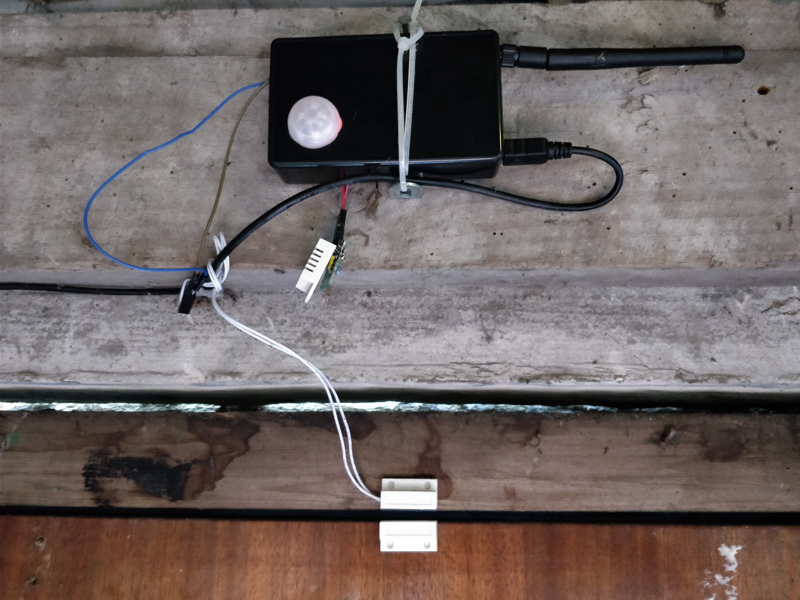

# MySensors

This repo contains my Arduino homeauto sensor sketches, notes, etc which make up the sensor array part of the home auto project.

Sensors interface with homeassistant via a [MySensors](https://www.mysensors.org/) gateway node.

## TouchCap

An Arduino board hooked up to a metal object serves as a touch switch for the bedroom light. This sketch sends a signal to the homeserver whenever this singing bowl is touched:

## GHMonitor

A temperature & humidity sensor (DHT22) for the greenhouse to monitor conditions for tomatoes. Battery operated, low power. Homeassistant warns when temp or humidity leave acceptable range.

## GarageMonitor

Security sensor for the garage incorporating:

 - motion
 - sound
 - door (open/close)

I had to manually debounce the motion detector because occasionally a spider wanders over the sensor.

Alarm signal is passed to homeassistant which raises the alarm via mobile notification and Sonos speakers in the house.

