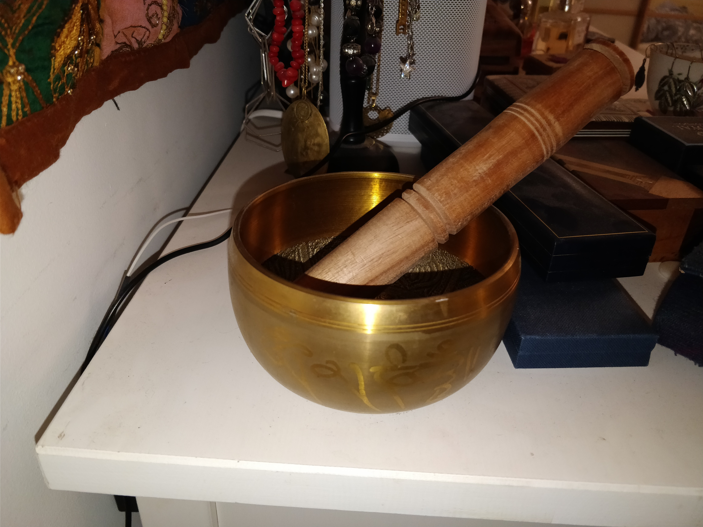

# MySensors

This repo contains my Arduino homeauto sensor sketches, notes, etc which make up the sensor array part of the home auto project.

Sensors interface with homeassistant via a [MySensors](https://www.mysensors.org/) gateway node.

## TouchCap

An Arduino board hooked up to a metal object serves as a touch switch for the bedroom light. This sketch sends a signal to the homeserver whenever this singing bowl is touched:

## GHMonitor

## GarageMonitor
